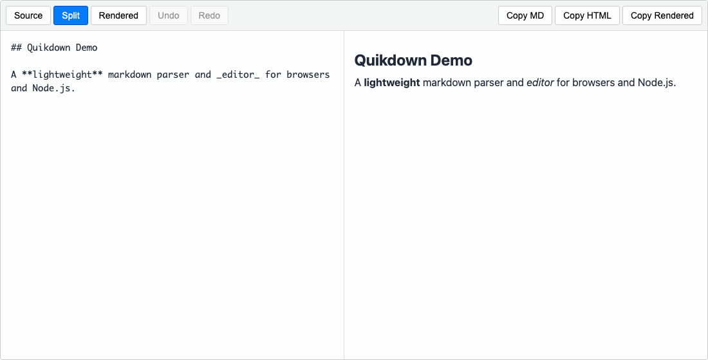

# quikdown

[](https://github.com/deftio/quikdown/actions/workflows/ci.yml)
[](https://www.npmjs.com/package/quikdown)
[](https://github.com/deftio/quikdown)
[](https://opensource.org/licenses/BSD-2-Clause)
[](https://bundlephobia.com/package/quikdown)

Quikdown is a small, safe, bidirectional Markdown parser with a drop-in editor for browser and Node.js apps — with rich fenced-block rendering, Markdown ↔ HTML round-tripping, undo/redo, headless APIs, MCP tools, and a standalone offline build.

It is useful anywhere Markdown needs to remain the source of truth while users edit either the source or rendered view: docs, dashboards, CMS fields, internal tools, local/offline apps, chat UIs, and human/LLM co-editing workflows.

**[Try the Editor](https://deftio.github.io/quikdown/pages/edit/)** | **[Live Site](https://deftio.github.io/quikdown/pages/)** | **[Examples](https://deftio.github.io/quikdown/pages/examples/)** | **[Downloads](https://deftio.github.io/quikdown/pages/downloads/)** | **[Docs](docs/)**



*Split-mode view: Markdown source on the left, rendered preview on the right — with rendered Mermaid diagrams, MathJax equations, syntax-highlighted code, and other rich fences.*

## Why Quikdown?

Most Markdown libraries are either parsers, previewers, textarea editors, or large editor frameworks. Quikdown is meant to be a compact Markdown document surface: parse Markdown, render rich fences, edit source or rendered output, round-trip back to Markdown, and embed the whole thing with one import.

The original use case was LLM-assisted editing, where a model and a human both work on the same Markdown document. But the same requirements show up in many ordinary applications: CMS fields, documentation tools, internal dashboards, report builders, offline field tools, chat interfaces, and apps that need diagrams, math, tables, charts, maps, or other rich content inside Markdown without adopting a heavyweight editor stack.

Quikdown intentionally does not try to be a full CommonMark implementation or a ProseMirror replacement. It covers a practical Markdown subset and focuses on small size, safe defaults, bidirectional editing, rich fenced content, offline deployment, and simple application integration.

## Highlights

* **Drop-in editor** — one `<div>`, one import. Source, split, and preview modes with toolbar, themes, undo/redo, copy-as-rich-text, and rich fence rendering.
* **Bidirectional Markdown Parser Lib** — convert Markdown → HTML and supported Quikdown HTML → Markdown. Edit the rendered side and get Markdown back.
* **Rich fences** — built-in editor renderers for syntax-highlighted code, Mermaid, MathJax, SVG, CSV/TSV/PSV tables, GeoJSON maps, STL models, ABC music notation, Vega/Vega-Lite charts, and sanitized raw HTML.
* **Small core** — approximately 15–17 KB minified for the parser, with zero runtime dependencies.
* **Safe by default** — HTML is escaped, unsafe URL schemes are blocked, and the core parser uses no `eval` or dynamic regular expressions.
* **Offline standalone build** — a self-contained editor bundle for air-gapped, regulated, local, field, or desktop-app use with rich fence support.
* **LLM/agent friendly** — stream Markdown into the editor, let an agent modify the document, and roll back mistakes with programmatic undo/redo.
* **Headless API** — run the editor without a toolbar and wire it into your own UI or automation layer.
* **MCP server** — 24 tools for parsing, file operations, and editor control over JSON-RPC 2.0.
* **Structured output** — companion AST, JSON, YAML, and AST-to-HTML modules.

## Modules

Use only the pieces you need.

| Module | Size | Purpose |
| --- | --- | --- |
| quikdown.js | ~15–17 KB | Markdown → HTML parser. Safe defaults, fence plugin callbacks, inline styles or CSS classes. |
| quikdown_bd.js | ~22.7 KB | Bidirectional Markdown ↔ HTML conversion. |
| quikdown_edit.js | ~102.9 KB | Drop-in split-view headless editor control with undo/redo, toolbar, themes, copy-as-rich-text, and lazy-loaded fence plugins. |
| quikdown_edit_standalone.js | ~7.7 MB / ~1 MB gzipped | Offline editor with all fence libraries bundled. No CDN required. |
| quikdown_mcp.js | ~26 KB | MCP server with 24 tools for AI agents. |
| quikdown_ast / json / yaml / ast_html | ~5–8 KB each | Companion modules for structured output and AST-based rendering. |

## Install

Quikdown is available on [npm](https://www.npmjs.com/package/quikdown) and can also be loaded directly from [UNPKG](https://unpkg.com/quikdown) or [jsDelivr](https://cdn.jsdelivr.net/npm/quikdown).

```bash
npm install quikdown
```

### Browser via ES module

```js
<script type="module">
  import quikdown from 'https://unpkg.com/quikdown/dist/quikdown.esm.min.js';

  document.body.innerHTML = quikdown('# Hello World');
</script>
```

### Browser via UMD

```js
<script src="https://unpkg.com/quikdown/dist/quikdown.umd.min.js"></script>
<script>
  document.body.innerHTML = quikdown('# Hello World');
</script>
```

## Quick start

Quikdown has three common entry points: the core parser, the bidirectional parser, and the editor.

### Markdown → HTML

Use `quikdown` when you only need Markdown rendering.

```javascript
import quikdown from 'quikdown';

const markdown = '# Hello World\n\nThis is **Markdown**.';
const html = quikdown(markdown);

document.body.innerHTML = html;
```

You can choose inline styles or CSS classes.

```javascript
const html = quikdown(markdown, {
  inline_styles: true
});
```

### Markdown ↔ HTML

Use `quikdown_bd` when you need rendered HTML that can be converted back to Markdown.

```javascript
import quikdown_bd from 'quikdown/bd';

const html = quikdown_bd(markdown);
const markdownAgain = quikdown_bd.toMarkdown(html);
```

Quikdown’s HTML → Markdown conversion is designed for Quikdown-generated HTML and supported Markdown structures. It is not intended to be a generic arbitrary-HTML-to-Markdown converter.

Standard Markdown structures such as headings, text styles, links, lists, blockquotes, tables, and code fences are supported. For custom fences, Quikdown relies on its tag system or third-party handlers to provide reverse conversion.

### Drop-in editor

Use `QuikdownEditor` when you want source, split, or preview editing in the browser.

```javascript
const editor = new QuikdownEditor('#container', {
  mode: 'split',           // 'source', 'split', or 'preview'
  theme: 'auto',           // 'light', 'dark', or 'auto'
  plugins: {
    highlightjs: true,
    mermaid: true,
    mathjax: true
  }
});

editor.setMarkdown('# Content\n\nTo be quik or not to be.');
const markdown = editor.getMarkdown();
```

The editor can also run headless, without the built-in toolbar.

```javascript
const editor = new QuikdownEditor('#container', {
  mode: 'split',
  showToolbar: false
});

editor.setMarkdown(markdown);
editor.undo(); 
editor.redo();
editor.setTheme('dark');
editor.setMode('preview');
```

## Rendering support (fences)

Quikdown’s editor can render common fenced block formats while preserving the original fence source for round-trip editing. Note that quikdown itself can't support reverse editing for specialty fences such as mermaid or MathJax but callbacks are provided so those can be handled on a case-by-case basis.

Built-in editor fence handlers include:

* `js`, `javascript`, `python`, `c`, `cpp`, and other code fences via highlight.js
* `mermaid` diagrams
* `math`, `tex`, `latex`, and `katex` equations via MathJax
* `svg` inline graphics
* `csv`, `tsv`, and `psv` tables
* `geojson` maps via Leaflet
* `stl` 3D models via Three.js
* `abc` and `music` sheet music via ABCJS
* `vega`, `vega-lite`, and `vegalite` charts
* `html` fences sanitized with DOMPurify

Fence libraries are lazy-loaded by the editor when needed. Use the standalone build when you need everything bundled with no network access.

Custom fence handlers use a small callback API.

```javascript
const fencePlugin = {
  render: (content, language) => {
    if (language === 'mermaid') {
      return renderMermaid(content);
    }

    return undefined; // fall back to default handling
  }
};

const html = quikdown(markdown, {
  fence_plugin: fencePlugin
});
```

## Security model

Quikdown’s core parser escapes HTML by default. Only safe Markdown constructs become HTML unless a fence plugin explicitly renders additional content.

```javascript
const unsafe = '<script>alert("XSS")</script> **bold**';
const safe = quikdown(unsafe);

// &lt;script&gt;alert("XSS")&lt;/script&gt; <strong>bold</strong>
```

Security-related defaults and checks include:

* HTML escaped by default
* URL sanitization for links and images
* Blocking of `javascript:`, `vbscript:`, and non-image `data:` URIs
* No `eval`
* No dynamic `RegExp`
* Static regex patterns checked for ReDoS risk
* DOMPurify used by the built-in editor for raw HTML fences
* ESLint security checks enforced in CI

Fence plugins are trusted extension points. If a custom plugin returns HTML, that plugin is responsible for sanitizing what it renders.

For the full model, see [docs/security.md](docs/security.md).

## AST, JSON, and YAML output

Quikdown includes companion libraries for converting Markdown into structured data formats.

```javascript
import quikdown_ast from 'quikdown/ast';
import quikdown_json from 'quikdown/json';
import quikdown_yaml from 'quikdown/yaml';
import quikdown_ast_html from 'quikdown/ast-html';

const markdown = '# Hello\n\nWorld **bold**';

const ast = quikdown_ast(markdown);
const json = quikdown_json(markdown);
const yaml = quikdown_yaml(markdown);

const html = quikdown_ast_html(ast);
```

The AST parsers are forgiving and handle malformed Markdown gracefully without throwing errors. See [AST Documentation](docs/quikdown-ast.md) for the complete node type reference.

## Common integration patterns

Quikdown supports three common integration styles.

| Pattern | Use when | Entry point |
| --- | --- | --- |
| Parse-only | You need safe Markdown rendering or structured output in an app | import quikdown from 'quikdown' |
| File agent | An AI agent reads and writes Markdown/HTML files in a repo sandbox | npx quikdown-mcp --root=. |
| Doc copilot | A human edits in the browser while an agent controls the same document | node examples/mcp-doc-host/start-mcp.js |

The parse-only path is the default: zero config, browser or Node.js, and no runtime dependencies in the core parser.

The file-agent path adds MCP filesystem tools under a sandbox root. This is useful when the human stays in Cursor, VS Code, or another file editor.

The doc-copilot path opens a browser editor and lets an MCP client control the same live document through a Node bridge.

For details, see [docs/llm-integration.md](docs/llm-integration.md), [docs/quikdown-mcp.md](docs/quikdown-mcp.md), and [examples/mcp-doc-host](examples/mcp-doc-host/).

## LLM and agent workflows

Quikdown fits the loop where a model writes Markdown, a human sees rendered output, and both continue editing the same document.

| Pattern | Demo / docs |
| --- | --- |
| AI canvas: chat + document editor | examples/ai-canvas |
| Agent tool-calling on editor content | examples/llm-tool-editor |
| MCP doc copilot | examples/mcp-doc-host |
| Stream into QuikdownEditor | examples/llm-stream-editor |
| Stream tokens into rendered HTML | integration-llm-stream |
| Chat bubbles with Markdown | quikchat and integration example |

Overview: [docs/llm-integration.md](docs/llm-integration.md)

## MCP server

Quikdown includes an MCP server that lets AI agents parse Markdown, convert between formats, read/write files, and, with a doc host, control the editor — all over JSON-RPC 2.0.

### Two paths

| Path | Human UI | Command |
| --- | --- | --- |
| A — IDE | Cursor / VS Code file editor; no browser | npx quikdown-mcp --root=. |
| B — Doc copilot | Browser tab with QuikdownEditor; Node host bridges MCP | node examples/mcp-doc-host/start-mcp.js |

Path A is for repo/file workflows. Path B is for live document workflows where the human edits in the browser while the agent uses MCP against the same editor state.

```bash
npm install quikdown
npx quikdown-mcp --root=.
```

### MCP tools

Quikdown currently exposes 24 MCP tools in three groups.

| Group | Tools | Activated by |
| --- | --- | --- |
| Headless | markdown_to_html, html_to_markdown, markdown_stats, quikdown_info, markdown_to_ast, markdown_to_json | Always |
| Filesystem | read_file_info, read_file_lines, read_file_markdown, write_markdown_to_file, write_html_to_file | --root flag |
| Editor | read_editor, write_editor, find_regex, replace_regex, replace_text, extract_text, get_stats, get_html, undo, redo, load_file_to_editor, get_rendered, write_rendered_to_file | Editor binding |

### Cursor configuration: Path A

```json
{
  "mcpServers": {
    "quikdown": {
      "command": "npx",
      "args": [
        "quikdown-mcp",
        "--root=."
      ]
    }
  }
}
```

### Cursor configuration: Path B

From the Quikdown repo, run `npm run build` first, then configure:

```json
{
  "mcpServers": {
    "quikdown-doc": {
      "command": "node",
      "args": [
        "examples/mcp-doc-host/start-mcp.js"
      ]
    }
  }
}
```

This opens a browser tab with QuikdownEditor. You edit in the browser while the agent uses MCP.

See [examples/mcp-doc-host/README.md](examples/mcp-doc-host/README.md).

### Claude Desktop: Path A

```json
{
  "mcpServers": {
    "quikdown": {
      "command": "npx",
      "args": [
        "quikdown-mcp",
        "--root=."
      ]
    }
  }
}
```

### Programmatic MCP use

```javascript
import { createMcpServer } from 'quikdown/mcp';

const mcp = createMcpServer({ root: '.' });
const result = mcp.callTool('markdown_to_html', {
  markdown: '# Hello'
});
```

Full documentation: [docs/quikdown-mcp.md](docs/quikdown-mcp.md) | [MCP setup page](https://deftio.github.io/quikdown/pages/mcp/)

## Streaming

Quikdown’s parser is fast enough to re-parse the full buffer on every incoming chunk, so you do not need to manage incremental parser state.

### Stream tokens into rendered HTML

```javascript
let buffer = '';

for await (const chunk of llmStream) {
  buffer += chunk;
  previewEl.innerHTML = quikdown(buffer, {
    lazy_linefeeds: true
  });
}
```

### Stream tokens into QuikdownEditor

```javascript
let buffer = '';

for await (const chunk of llmStream) {
  buffer += chunk;
  await editor.setMarkdown(buffer);
}
```

Incomplete fences are handled gracefully. They render as plain text until the closing fence arrives.

See [docs/llm-integration.md](docs/llm-integration.md) for production patterns such as debouncing and undo grouping.

## Undo and redo

The editor maintains a configurable undo stack. The default is 100 states.

Keyboard shortcuts work out of the box.

| Action | Shortcut |
| --- | --- |
| Undo | Ctrl+Z / Cmd+Z |
| Redo | Ctrl+Shift+Z / Ctrl+Y |

```javascript
const editor = new QuikdownEditor('#container', {
  undoStackSize: 200,
  showUndoRedo: true
});

editor.undo();
editor.redo();

editor.canUndo();
editor.canRedo();

editor.clearHistory();
```

This is useful for ordinary editing and especially useful for human + agent workflows. Agents make mistakes, and users need reversible edits.

Undo and redo are also available as MCP tools in Path B.

Full API: [docs/quikdown-editor.md](docs/quikdown-editor.md)

## Copy as rich text

The editor can copy the rendered preview to the clipboard, including images, tables, and rendered fences.

This is useful when pasting Markdown-derived content into tools such as Gmail, Word, etc.

## Styling

Quikdown supports built-in styling for a batteries-included experience, or you can bring your own CSS.

### Inline styles

```javascript
quikdown('**bold**', {
  inline_styles: true
});

// <strong style="font-weight: bold;">bold</strong>
```

### CSS classes

Class-based styling is the default.

```javascript
quikdown('**bold**');

// <strong>bold</strong>
```

Use the included CSS files as starting points:

* `dist/quikdown.light.css`
* `dist/quikdown.dark.css`

## Configuration

```javascript
const html = quikdown(markdown, {
  lazy_linefeeds: true,    // single newlines become <br>
  inline_styles: false,    // use CSS classes instead of inline styles
  fence_plugin: {
    render: myHandler
  }
});
```

Optional features include heading IDs, reference-style links, and footnotes.

```javascript
const html = quikdown(markdown, {
  heading_ids: true,
  reference_links: true,
  footnotes: true
});
```

## TypeScript

Quikdown includes TypeScript definitions for all modules.

```typescript
import quikdown, {
  QuikdownOptions,
  FencePlugin
} from 'quikdown';

const fencePlugin: FencePlugin = {
  render: (content: string, language: string) => {
    return `<pre class="hljs ${language}">${content}</pre>`;
  }
};

const options: QuikdownOptions = {
  inline_styles: true,
  fence_plugin: fencePlugin
};

const html: string = quikdown(markdown, options);
```

## Supported Markdown

Quikdown supports the Markdown structures most commonly used in application content.

### Text formatting

* `**bold**`
* `*italic*`
* `~~strikethrough~~`
* `` `code` ``

### Blocks

* Headings: `# H1` through `###### H6`
* Paragraphs
* Blockquotes
* Horizontal rules
* Fenced code blocks
* Tables
* Ordered lists
* Unordered lists
* Task lists

### Links and media

* Inline links: `[text](url)`
* Automatic URL detection
* Images
* Optional heading slugs with `heading_ids: true`

Reference-style links and footnotes are available as opt-in features.

For the complete syntax reference, see [docs/](docs/).

## Framework integration

Quikdown works with React, Vue, Svelte, Angular, and plain browser apps.

See [Framework Integration Guide](docs/framework-integration.md).

For LLM and agent patterns, see [LLM Integration](docs/llm-integration.md).

## Standalone / air-gapped build

The standalone editor bundles all fence libraries. No CDN or network access is required.

```bash
# Download from GitHub Releases
# or build locally:
npm run build:standalone
```

```html
<div id="editor"></div>
<script src="quikdown_edit_standalone.umd.min.js"></script>
<script>
  const editor = new QuikdownEditor('#editor', {
    mode: 'split'
  });

  editor.setMarkdown('# Works offline');
</script>
```

Use cases include:

* Air-gapped networks
* Regulated environments
* Offline demos
* Field deployments
* Local-first tools
* Electron and Tauri apps
* Desktop apps such as [QuikLeaf](https://github.com/deftio/quikleaf)

See [docs/standalone-editor.md](docs/standalone-editor.md) for the full list of bundled libraries and build details.

Pre-built zip files are available on [GitHub Releases](https://github.com/deftio/quikdown/releases).

## Comparison

Quikdown overlaps with Markdown parsers, textarea-based Markdown editors, and larger editor frameworks, but it makes a different set of tradeoffs.

|  | Quikdown | marked | markdown-it | ProseMirror + Markdown |
| --- | --- | --- | --- | --- |
| Parser size | ~15–17 KB | ~40 KB | ~100 KB | ~200 KB+ |
| Editor included | Yes, ~102.9 KB | No | No | Yes, large stack |
| Bidirectional Markdown ↔ HTML | Yes | No | No | Yes, with framework integration |
| Rich fence rendering | Built into editor | Plugin/custom | Plugin/custom | Plugin/schema work |
| Fence round-trip preservation | Yes | No | No | Custom implementation |
| XSS-safe by default | Yes | No, opt-in | No, opt-in | Depends on schema |
| Streaming-friendly | Yes | Yes | Yes | More complex |
| Offline standalone build | Yes | N/A | N/A | Custom bundling |
| Runtime deps, core parser | 0 | 0 | 0 | Many |
| MCP server | Included | No | No | No |
| CommonMark coverage | Practical subset | Broad/full | Broad/full | Depends on stack |

Quikdown intentionally trades full CommonMark coverage for a smaller, more integrated package.

If you need full spec compliance, use a spec-complete parser. If you need a full collaborative block editor, use a larger editor framework. Quikdown is for compact Markdown rendering/editing where small size, safety, fences, round-tripping, and application integration matter.

## What Quikdown is not

Quikdown makes deliberate tradeoffs.

* **Not a full CommonMark parser** — definition lists and some edge-case syntax are intentionally omitted. Reference-style links and footnotes are available as opt-in features.
* **Not a generic HTML-to-Markdown converter** — bidirectional conversion is designed for Quikdown-generated HTML and supported Markdown structures.
* **Not a block editor framework** — the editor is Markdown-first, not a Notion-style or ProseMirror-style block editor.
* **Not a giant editor stack** — no virtual DOM requirement, no complex state store, and no large plugin framework.

Raw HTML and SVG can be rendered through fence plugins with appropriate sanitization. The built-in editor uses DOMPurify for the `html` fence.

## Related projects

* [QuikChat](https://github.com/deftio/quikchat) — simple chat UI library that can use Quikdown for Markdown rendering.
* [QuikLeaf](https://github.com/deftio/quikleaf) — offline desktop app built around the standalone Quikdown editor.

## API reference

For complete API documentation, see [docs/api-reference.md](docs/api-reference.md).

## Contributing

Contributions are welcome. See [CONTRIBUTING.md](CONTRIBUTING.md) for development setup, build steps, and contribution guidelines.

## License

BSD 2-Clause — see [LICENSE.txt](LICENSE.txt).

## Acknowledgments

* Inspired by the simplicity of other Markdown parsers and projects
* Built for the [QuikChat](https://github.com/deftio/quikchat) project
* Informed by the CommonMark spec and practical Markdown usage in modern apps

## Support

* [Documentation](docs/)
* [Issues](https://github.com/deftio/quikdown/issues)
* [Examples hub](https://deftio.github.io/quikdown/pages/examples/)
* [examples/](examples/)  

