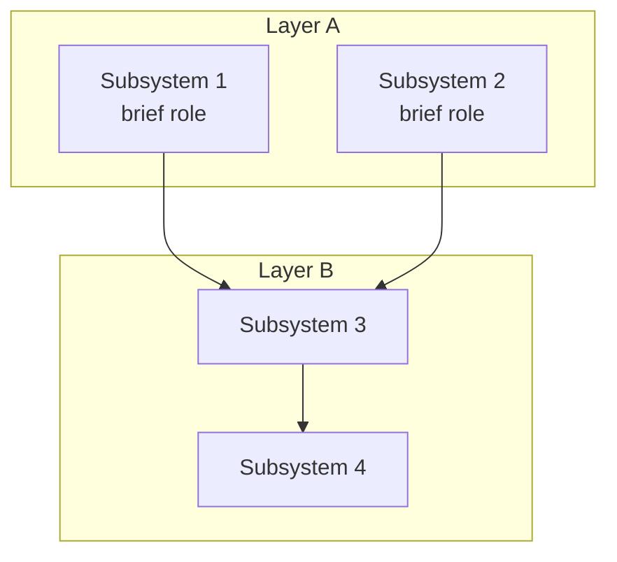

# United States Provisional Patent Application

> *Template for BSMH Labs LLC provisional filings. Italic blockquotes like this one are author guidance — delete them when filling the template in.*
>
> *Authoring rules carried over from the 21 May 2026 attorney conversation with Mike:*
>
> *1. **Disclosure first, claims second.** A provisional stands or falls on whether a person of ordinary skill in the art (POSITA) can read it and build the thing. The attorney will draft the formal claim set at utility conversion. Keep the Draft Claims section short and broad; do not try to write narrow dependent claims.*
>
> *2. **No "the present invention is X" / "the invention provides Y" / "this invention."** Use embodiment-safe phrasing throughout: "one or more embodiments described herein pertain to…", "an embodiment of the invention comprises…", "in one or more such embodiments…". The reason is litigation-defensive — opposing counsel uses "the present invention is X" language to argue the claims are limited to X. Embodiment language preserves the option to argue broader scope.*
>
> *3. **Recipe, not essay.** Each subsystem section should describe inputs, procedure, and outputs concretely enough that a competent engineer could implement it. Use pseudo-code where an algorithm matters; use mermaid diagrams for structures, flows, and sequences. Avoid dumping production source code with line ranges — pseudo-code travels better than code coupled to a specific repo.*
>
> *4. **Each named subsystem needs at least one "how."** If the spec names an "engine," "evaluator," "executor," "router," etc., the spec must show at least one concrete way to build that thing — a function signature with a substantive body, a data schema, a state machine, a worked example, or pseudo-code. Result-oriented descriptions ("an X operative to do Y") with no mechanism behind them are exactly what examiners and courts reject in AI claims.*
>
> *5. **Show what's different.** Where it helps, contrast today's approach with the disclosed embodiment in one or two paragraphs and one pseudo-code block per side. Often clearer than describing the embodiment alone.*
>
> *6. **Define novel terms.** Any term that is ambiguous or coined for this disclosure goes in the Definitions section with a non-limiting functional definition. Prevents construction surprises.*
>
> *7. **Readable. Not too long.** Density is not depth. Tight prose, named subsections, and diagrams beat sprawling exposition.*

---

## Title

*\<short, descriptive title — no marketing language\>*

## Inventors

*\<one block per inventor, exactly as below\>*

**\<Full Legal Name\>**\
\<Street Address\>\
\<City, State\>\
Citizenship: \<Country\>

## Assignee

BSMH Labs LLC
Small Entity Status Claimed

## Priority Filing

* **Priority Claims** (this invention refers to application/patent #) — None
* **Foreign** (note any pending foreign patents or applications) — None
* **US** — None
* **Work for hire** — no
* **Work under US Government contracts** — no
* **Work under Foreign Government contracts** — no
* **Secret** — no

---

## Abstract

> *Single paragraph, roughly 150–250 words. Open with the embodiment-safe form. Say what the embodiments do, the problem they address, and the one or two mechanisms that are novel. Resist the urge to enumerate every feature — that's what the body is for.*

One or more embodiments described herein pertain to *\<short statement of the technical area and what the embodiments do\>*. *\<One sentence on the problem in the prior art that motivates the embodiments.\>* *\<Two or three sentences naming the inventive mechanism in plain language, in terms an engineer could understand without reading the rest.\>* *\<One sentence on application domains or preferred embodiment.\>*

## Field of the Invention

> *Two or three sentences. Plain English. Name the technical discipline and the specific class of system the embodiments fall into.*

One or more embodiments described herein pertain to *\<broad technical field, in plain English — e.g., "artificial intelligence and autonomous agent supervision," or "agentic workflow orchestration and veracity verification"\>*. More specifically, such embodiments pertain to *\<the specific class of system, in one phrase — e.g., "systems and methods for intercepting tool invocations issued by autonomous agents before execution"\>*.

## Background of the Invention and Prior Art

> *Paint the picture in 2–5 short paragraphs. Cover the relevant state of the art — name representative existing systems if it helps the reader orient. Identify the gap or problem the embodiments address. Do not over-claim novelty here; that's for the Description. Do not concede prior art either — describe the state of practice neutrally. Avoid phrases like "the present invention solves" in this section; that's an embodiment-narrowing trap.*

*\<Paragraph 1 — what exists in the relevant field, briefly.\>*

*\<Paragraph 2 — the limitation or gap in current approaches that the disclosed embodiments address. Keep it concrete: "Existing approaches do X by doing Y. This produces problem Z."\>*

*\<Optional paragraph 3 — why earlier patches don't solve the problem (e.g., why a simpler fix at one layer does not work).\>*

## Brief Description of Drawings

> *One line per figure or mermaid diagram. Use sequential FIG. numbering. This section is short but earns its place by making the document navigable and by lining the patent up for utility conversion, where formal drawings are required.*

* **FIG. 1** — *\<one-line caption, e.g., "Overall system architecture showing the relationships among the principal subsystems."\>*
* **FIG. 2** — *\<one-line caption\>*
* **FIG. 3** — *\<one-line caption\>*

---

## Description of the Invention

> *This is the heart of the disclosure. Open with the System Architecture Overview, then Definitions, then one named subsection per inventive mechanism. Each subsection should follow the recipe pattern: what it takes in, what it does step by step, what it puts out, and one or two alternative ways to do it.*

### System Architecture Overview

> *One mermaid diagram (FIG. 1) showing the principal subsystems and their relationships, plus one short paragraph naming each box and what it does in one sentence. This gives the POSITA a single picture to anchor the rest of the document against.*



*\<Paragraph: name each box, one sentence each, and call out the data flow. Reference each subsystem section by its number.\>*

### Definitions of Terms

> *Four to eight terms maximum. Include only terms that are (a) coined for this disclosure, (b) used in a non-standard sense, or (c) likely to be construed narrowly without an explicit definition. Each definition is functional and non-limiting — define what the thing does, then give two or three representative implementations introduced by "non-limiting examples include."*

* **\<Term\>** — *\<one-sentence functional definition.\>* Non-limiting examples include *\<two or three concrete implementations or instantiations.\>*

* **\<Term\>** — *\<one-sentence functional definition.\>* Non-limiting examples include *\<two or three concrete implementations or instantiations.\>*

### \<Inventive Subsystem 1 — short name\>

> *Open with one sentence stating what this subsystem does. Then walk it in recipe form. Where the contrast with current practice is informative, include a brief "Today vs. the disclosed embodiment" sub-block.*

*\<One-sentence overview.\>*

**Today's approach.** *\<One paragraph describing how this is typically done in the prior art. Optional pseudo-code block if it helps. Skip if not informative for this subsystem.\>*

```python
# pseudo-code: how this is done today
...
```

**The disclosed embodiment.** *\<Inputs: what the subsystem receives, in concrete shape — a schema, an example, or a sentence. Procedure: numbered or lettered steps, each one observable action. Outputs: what the subsystem emits, in concrete shape.\>*

```python
# pseudo-code: how a representative embodiment works
def example_procedure(input):
    # 1. ...
    # 2. ...
    # 3. ...
    return output
```

**Alternative embodiments.** *\<Two or three variations that swap a step or substitute a component, each in one sentence.\>*

### \<Inventive Subsystem 2\>

> *Same pattern. One per major mechanism.*

### \<Inventive Subsystem N\>

---

## Example Embodiments

> *One concrete preferred embodiment described in narrative form, end-to-end, with the data that flows through it. Plus a short list of alternative embodiments showing the architecture applied to different domains or substrates.*

### Preferred Embodiment

*\<Walk one realistic scenario from input to output. Use concrete names, concrete values, and concrete data shapes. The reader should be able to follow the example without re-reading any other section.\>*

### Alternative Embodiments

* *\<Embodiment in domain A — one short paragraph showing how the same architecture applies.\>*
* *\<Embodiment in domain B.\>*
* *\<Embodiment in domain C.\>*

---

## Objects and Advantages

> *Bullet list of the concrete advantages the disclosed embodiments provide over prior art. Each item should pair an inventive mechanism with the operational benefit it produces. Avoid marketing language; engineers and examiners respond to specifics.*

One or more embodiments described herein provide the following advantages over existing systems:

* *\<Advantage 1 — name the mechanism and the benefit. E.g., "Tamper-evident verification: the verifier must enumerate evidence to claim a category, and independent recomputation overrides the verifier's self-report on disagreement."\>*
* *\<Advantage 2\>*
* *\<Advantage 3\>*

---

## Draft Claims

> *Keep this section deliberately short and broad. The attorney drafts the formal claim set at utility conversion; the purpose of including claims in the provisional is to anchor the disclosure to a specific inventive contribution and to serve as an audit aid. Two or three plain-language claims are usually sufficient. Use "An embodiment of the invention…" framing rather than "The present invention is…"*

**Claim 1.** An embodiment of the invention comprises *\<the inventive system or method, in one or two sentences, naming the principal components or steps and the structural relationship among them\>*.

**Claim 2.** The embodiment of Claim 1, wherein *\<one narrowing variation — typically the preferred embodiment or one important alternative\>*.

**Claim 3.** The embodiment of Claim 1, applied to any of *\<application domains, with an explicit catch-all "or any other domain in which …" at the end\>*.

---

> *End of template. When filling in: delete every italic guidance blockquote, every angle-bracket placeholder, and this footer. The remaining document should read as a continuous, self-contained disclosure that an engineer skilled in the relevant art could use to build the disclosed embodiments.*
