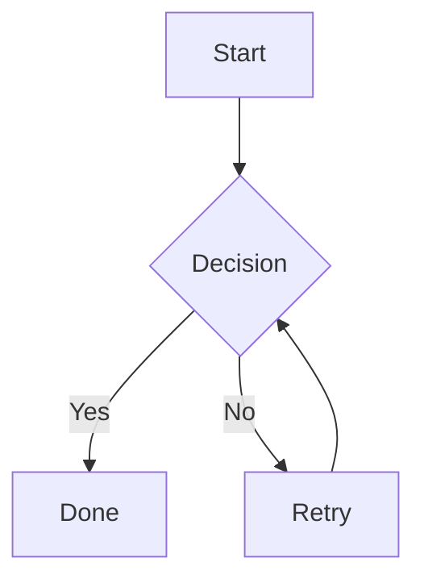
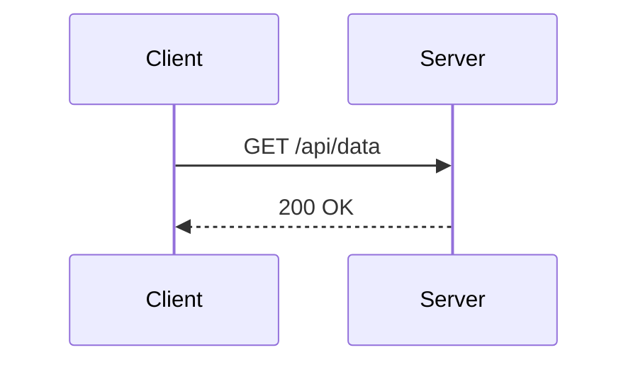

# Fence authoring guide

Quikdown **fenced code blocks** (triple backticks or tildes) can do much more than syntax highlighting. In the **QuikdownEditor** preview, many fence language tags trigger rich renderers: diagrams, math, maps, charts, music, 3D models, and sanitized HTML.

This guide is for **authors** writing markdown that should render correctly in the editor (and in the **standalone offline** bundle). For embedding fences in your own app via the core parser API, see [Plugin Development](plugin-guide.md).

---

## How fences work

### Parser vs editor

| Layer | Behavior |
|-------|----------|
| **Core parser** (`quikdown`) | Renders fences as `<pre><code class="quikdown-code">…</code></pre>` unless you supply a `fence_plugin`. |
| **Editor** (`quikdown/edit`) | With `enableComplexFences: true` (default), built-in handlers replace many fence types with live previews. |

### Fence syntax

Use standard markdown fences. Language tag is case-insensitive in the editor.

````markdown
```language
content here
```
````

Tilde fences work too:

~~~markdown
~~~mermaid
graph LR
  A --> B
~~~
~~~

### Editor options that affect fences

| Option | Default | Effect |
|--------|---------|--------|
| `enableComplexFences` | `true` | Master switch for all built-in renderers below. |
| `preloadFences` | `null` | `'all'`, a library name array, or lazy-load on first use. |
| `allowExternalFetch` | `true` (regular editor) / `false` (standalone) | Blocks CDN loads and external Vega `url` / OSM tiles when `false`. |
| `customFences` | `{}` | Your handlers run **before** built-ins. |

**Regular editor:** fence libraries load from CDN the first time a block of that type appears.

**Standalone editor:** libraries are pre-bundled; GeoJSON uses a local vector basemap file; Vega specs must use inline `"values"` (no external `"url"`).

---

## Quick reference

| Fence tag(s) | Renders | Library | Offline (standalone) |
|--------------|---------|---------|----------------------|
| `javascript`, `python`, `java`, … | Syntax-highlighted code | Highlight.js | Yes |
| `mermaid` | Flowcharts, sequence, Gantt, … | Mermaid | Yes |
| `math`, `tex`, `latex`, `katex` | Display math (LaTeX) | MathJax v3 | Yes |
| `geojson` | Map + your features | Leaflet | Yes (vector basemap) |
| `stl` | Rotating 3D mesh | Three.js | Yes |
| `abc`, `music` | Sheet music | ABCJS | Yes |
| `vega`, `vega-lite`, `vegalite` | Chart / visualization | Vega + Vega-Lite + Embed | Yes (inline data only) |
| `csv` | HTML table | Built-in | Yes |
| `psv` | Pipe-separated table | Built-in | Yes |
| `tsv` | Tab-separated table | Built-in | Yes |
| `svg` | Inline SVG (sanitized) | Built-in | Yes |
| `html` | Sanitized HTML fragment | DOMPurify | Yes |
| `json`, `json5` | Highlighted JSON | Highlight.js / built-in | Yes |

---

## Programming languages (Highlight.js)

**Tags:** any common language name, e.g. `javascript`, `js`, `typescript`, `ts`, `python`, `py`, `java`, `cpp`, `c`, `css`, `html`, `xml`, `json`, `bash`, `sh`, `shell`, `sql`.

**Standalone bundle** pre-registers: JavaScript/JSX, TypeScript, Python, Java, C, C++, CSS, HTML/XML, JSON, Bash, Shell, SQL.

### Example

````markdown
```javascript
function greet(name) {
  return `Hello, ${name}!`;
}
```
````

### Authoring tips

- First line after the opening fence should be the language tag only (no extra text).
- Unknown languages fall back to plain monospace `<pre><code>` without highlighting.
- For JSON-specific highlighting use `json` or `json5` tags (see below).

---

## Mermaid (`mermaid`)

**Renders:** Flowcharts, sequence diagrams, class diagrams, state diagrams, Gantt charts, pie charts, git graphs, and other [Mermaid](https://mermaid.js.org/) diagram types.

### Example — flowchart

````markdown

````

### Example — sequence diagram

````markdown

````

### Authoring tips

- Mermaid is whitespace-sensitive; indent consistently.
- Invalid syntax shows an error in the preview panel.
- Large diagrams may need horizontal scroll in split view.
- Bidirectional editing preserves the fence as ` ```mermaid ` with original source.

---

## Math (`math`, `tex`, `latex`, `katex`)

**Renders:** Display-mode LaTeX via MathJax (SVG output).

**Aliases:** `math`, `tex`, `latex`, `katex` (all use the same MathJax path).

### Example

````markdown
```math
E = mc^2
```

```math
\int_0^\infty e^{-x^2}\, dx = \frac{\sqrt{\pi}}{2}
```

```math
\begin{align}
a &= b + c \\
d &= e + f
\end{align}
```
````

### Authoring tips

- Content is treated as **display math** (block, centered). Multi-line content is collapsed to one line before typesetting; use `\begin{align}…\end{align}` for aligned equations.
- Backslashes must be written normally in markdown (e.g. `\frac`, not `\\frac` unless you need a literal backslash).
- Inline `$…$` math in ordinary paragraphs is **not** parsed by quikdown; use a `math` fence for display equations in preview.
- First render may briefly show raw LaTeX until MathJax finishes (especially in standalone).

---

## GeoJSON (`geojson`)

**Renders:** An interactive Leaflet map with your GeoJSON on top of a basemap.

### Example — point

````markdown
```geojson
{
  "type": "Point",
  "coordinates": [-122.4194, 37.7749]
}
```
````

### Example — FeatureCollection

````markdown
```geojson
{
  "type": "FeatureCollection",
  "features": [
    {
      "type": "Feature",
      "properties": { "name": "San Francisco" },
      "geometry": {
        "type": "Point",
        "coordinates": [-122.4194, 37.7749]
      }
    }
  ]
}
```
````

### Authoring tips

- Must be **valid JSON**. Use `"coordinates": [longitude, latitude]` (GeoJSON order).
- **Regular editor:** basemap uses OpenStreetMap tiles (requires network).
- **Standalone / offline:** uses bundled country vector basemap (`basemap_world_10m.topojson` next to the standalone JS). No tile downloads.
- Single-point features zoom to level 13; lines/polygons use `fitBounds`.
- Copy-rendered tries to capture the map canvas for paste into rich-text apps.

---

## STL 3D models (`stl`)

**Renders:** A rotating 3D mesh from ASCII STL solid data.

### Example (minimal ASCII STL)

````markdown
```stl
solid cube
  facet normal 0 0 1
    outer loop
      vertex 0 0 1
      vertex 1 0 1
      vertex 1 1 1
    endloop
  endfacet
endsolid cube
```
````

### Authoring tips

- Supports **ASCII STL** (starts with `solid`). Binary STL is not supported in-fence.
- Viewer auto-rotates the mesh for preview; fixed 400px height.
- Large meshes may be slow; keep files reasonably sized for browser WebGL.

---

## ABC music (`abc`, `music`)

**Renders:** Standard music notation from [ABC notation](https://abcnotation.com/) via ABCJS.

**Tags:** `abc` or `music` (equivalent).

### Example — simple tune

````markdown
```abc
X:1
T:Example Reel
M:4/4
L:1/8
K:G
|: G2 BG dG BG | A2 FA dA FA :|
```
````

### Example — scale

````markdown
```music
X:1
M:4/4
L:1/4
K:C
C D E F | G A B c |
```
````

### Header fields (common)

| Field | Meaning |
|-------|---------|
| `X:` | Reference number |
| `T:` | Title |
| `M:` | Meter (e.g. `4/4`, `3/4`, `C`) |
| `L:` | Default note length |
| `K:` | Key (e.g. `C`, `G`, `Am`) |
| `Q:` | Tempo |
| `V:` | Voice (multi-voice scores) |

### Authoring tips

- ABCJS `renderAbc` runs with `{ responsive: 'resize' }` — notation scales to container width.
- Body lines after headers contain notes, bars (`|`), repeats (`|:`, `:|`), and chords in quotes.
- Syntax errors show `ABC notation error:` in the preview.
- For full ABC spec features (grace notes, decorations, lyrics), see the [ABC standard](https://abcnotation.com/wiki/abc:standard:v2.1).

---

## Vega & Vega-Lite (`vega`, `vega-lite`, `vegalite`)

**Renders:** Interactive charts from a JSON **spec** using [Vega-Embed](https://github.com/vega/vega-embed) (SVG renderer, no action menu).

**Tags:**

- `vega` — full [Vega](https://vega.github.io/vega/) spec
- `vega-lite` or `vegalite` — [Vega-Lite](https://vega.github.io/vega-lite/) spec (recommended for most charts)

### Example — Vega-Lite bar chart

````markdown
```vega-lite
{
  "title": "Quarterly sales",
  "data": {
    "values": [
      { "quarter": "Q1", "sales": 28 },
      { "quarter": "Q2", "sales": 55 },
      { "quarter": "Q3", "sales": 43 },
      { "quarter": "Q4", "sales": 91 }
    ]
  },
  "mark": "bar",
  "encoding": {
    "x": { "field": "quarter", "type": "nominal" },
    "y": { "field": "sales", "type": "quantitative" }
  }
}
```
````

### Example — line chart with color

````markdown
```vegalite
{
  "data": {
    "values": [
      { "month": "Jan", "value": 12, "series": "A" },
      { "month": "Feb", "value": 18, "series": "A" },
      { "month": "Jan", "value": 9,  "series": "B" },
      { "month": "Feb", "value": 14, "series": "B" }
    ]
  },
  "mark": "line",
  "encoding": {
    "x": { "field": "month", "type": "ordinal" },
    "y": { "field": "value", "type": "quantitative" },
    "color": { "field": "series", "type": "nominal" }
  }
}
```
````

### Example — full Vega spec

````markdown
```vega
{
  "$schema": "https://vega.github.io/schema/vega/v5.json",
  "width": 300,
  "height": 200,
  "data": [
    {
      "name": "table",
      "values": [
        { "category": "A", "amount": 28 },
        { "category": "B", "amount": 55 }
      ]
    }
  ],
  "scales": [
    { "name": "xscale", "type": "band", "domain": { "data": "table", "field": "category" }, "range": "width", "padding": 0.05 },
    { "name": "yscale", "domain": { "data": "table", "field": "amount" }, "nice": true, "range": "height" }
  ],
  "axes": [
    { "orient": "bottom", "scale": "xscale" },
    { "orient": "left", "scale": "yscale" }
  ],
  "marks": [
    {
      "type": "rect",
      "from": { "data": "table" },
      "encode": {
        "enter": {
          "x": { "scale": "xscale", "field": "category" },
          "width": { "scale": "xscale", "band": 1 },
          "y": { "scale": "yscale", "field": "amount" },
          "y2": { "scale": "yscale", "value": 0 },
          "fill": { "value": "steelblue" }
        }
      }
    }
  ]
}
```
````

### Authoring tips

- Fence body must be **valid JSON**. Use a JSON validator if the chart fails silently.
- For `vega-lite` / `vegalite`, if `$schema` is omitted quikdown adds the Vega-Lite v5 schema automatically.
- **Offline / standalone:** specs with `"url": "https://…"` data sources are **rejected** when `allowExternalFetch` is false. Use inline `"values": [ … ]` arrays instead.
- Prefer **Vega-Lite** for bar, line, scatter, area, and layered charts; use full **Vega** when you need custom marks or transforms.
- See the [Vega-Lite examples gallery](https://vega.github.io/vega-lite/examples/) for copy-paste starting points (convert YAML examples to JSON for fences).

---

## CSV / PSV / TSV tables (`csv`, `psv`, `tsv`)

**Renders:** HTML tables (not markdown pipe tables).

| Tag | Delimiter |
|-----|-----------|
| `csv` | Comma `,` |
| `psv` | Pipe `\|` |
| `tsv` | Tab |

### Example — CSV

````markdown
```csv
Name,Role,Active
Alice,Engineer,true
Bob,Designer,true
Carol,PM,false
```
````

### Example — PSV

````markdown
```psv
Item | Qty | Price
Widget | 3 | 9.99
Gadget | 1 | 24.50
```
````

### Authoring tips

- First row is always the **header**.
- Quoted CSV fields (`"value, with comma"`) are supported via the built-in line parser.
- In bidirectional mode, editing the HTML table can round-trip back to fence source.
- For markdown-native tables use pipe syntax outside fences (see [sample-tables.md](../examples/sample-tables.md)).

---

## SVG (`svg`)

**Renders:** Inline SVG in the preview (scripts and event handlers stripped).

### Example

````markdown
```svg
<svg xmlns="http://www.w3.org/2000/svg" viewBox="0 0 100 100">
  <circle cx="50" cy="50" r="40" fill="#39f" stroke="#333" stroke-width="2"/>
  <text x="50" y="55" text-anchor="middle" fill="white" font-size="14">SVG</text>
</svg>
```
````

### Authoring tips

- Invalid XML shows `Invalid SVG` in the preview.
- `<script>`, `onclick`, and `javascript:` URLs are removed for security.
- Useful for logos and simple diagrams without Mermaid.

---

## HTML (`html`)

**Renders:** A sanitized HTML fragment via DOMPurify.

### Example

````markdown
```html
<div style="padding: 12px; background: #e3f2fd; border-radius: 6px;">
  <strong>Note:</strong> This HTML is sanitized before render.
</div>
```
````

### Authoring tips

- Not the same as `allowUnsafeHTML` on the editor — the fence always goes through DOMPurify when the library is loaded.
- `<script>`, iframes, and dangerous URLs are stripped.
- For arbitrary HTML in markdown body text, see the editor’s HTML mode and [Security Guide](security.md).

---

## JSON (`json`, `json5`)

**Renders:** Syntax-highlighted JSON when Highlight.js is available; otherwise escaped plain code.

### Example

````markdown
```json
{
  "name": "quikdown",
  "features": ["parser", "editor", "mcp"],
  "version": "1.2.17"
}
```
````

---

## Preloading fence libraries

For demos or known content, preload libraries at editor construction:

```javascript
import QuikdownEditor from 'quikdown/edit';

const editor = new QuikdownEditor('#editor', {
  preloadFences: ['mermaid', 'math', 'abc', 'vega', 'geojson']
});

// Or everything at once:
const editorAll = new QuikdownEditor('#editor', { preloadFences: 'all' });
```

Recognized preload names: `highlightjs`, `mermaid`, `math`, `geojson`, `stl`, `abc`, `music`, `vega`.

---

## Custom fences

Override or extend built-ins:

```javascript
new QuikdownEditor('#editor', {
  customFences: {
    plantuml: (code) => ``,
    mychart: (code, lang) => renderFromJson(code)
  }
});
```

Return `undefined` to fall through to built-in handling. See [Plugin Development](plugin-guide.md).

---

## Related docs

- [Editor API](quikdown-editor.md) — all editor options and methods
- [Standalone editor](standalone-editor.md) — offline bundle and `allowExternalFetch`
- [Plugin Development](plugin-guide.md) — core `fence_plugin` API
- [Bidirectional conversion](quikdown-bidirectional.md) — round-trip fence source from preview
- [examples/sample-fence.md](../examples/sample-fence.md) — Mermaid and code samples
- [examples/sample-many-fences.md](../examples/sample-many-fences.md) — mixed fence demo doc
