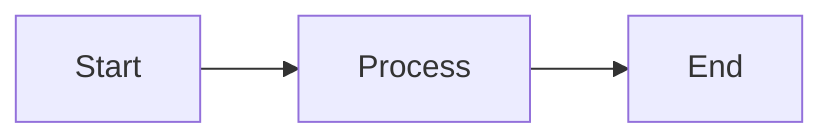

# Quikdown Editor Documentation

Quikdown Editor is a drop-in markdown editor control that provides a complete editing experience with live preview, bidirectional editing, and plugin support.

## Table of Contents

- [Installation](#installation)
- [Basic Usage](#basic-usage)
- [Configuration Options](#configuration-options)
- [API Reference](#api-reference)
- [View Modes](#view-modes)
- [Themes](#themes)
- [Plugin Integration](#plugin-integration)
- [Events and Callbacks](#events-and-callbacks)
- [Keyboard Shortcuts](#keyboard-shortcuts)
- [Examples](#examples)
- [Browser Support](#browser-support)

## Installation

### CDN

```html
<!-- ES Module -->
<script type="module">
  import QuikdownEditor from 'https://unpkg.com/quikdown/dist/quikdown_edit.esm.min.js';
</script>

<!-- UMD -->
<script src="https://unpkg.com/quikdown/dist/quikdown_edit.umd.min.js"></script>
```

### NPM

```bash
npm install quikdown
```

```javascript
// ES Module
import QuikdownEditor from 'quikdown/edit';

// CommonJS
const QuikdownEditor = require('quikdown/edit');
```

## Basic Usage

### Minimal Setup

```html
<!DOCTYPE html>
<html>
<head>
    <meta charset="UTF-8">
    <title>Quikdown Editor</title>
</head>
<body>
    <div id="editor" style="height: 400px;"></div>
    
    <script type="module">
        import QuikdownEditor from 'https://unpkg.com/quikdown/dist/quikdown_edit.esm.min.js';
        
        const editor = new QuikdownEditor('#editor');
        editor.setMarkdown('# Hello World\n\nStart editing!');
    </script>
</body>
</html>
```

### With Options

```javascript
const editor = new QuikdownEditor('#editor', {
    mode: 'split',           // View mode
    theme: 'dark',           // Theme
    showToolbar: true,       // Show toolbar
    lazy_linefeeds: false,   // Lazy linefeeds
    debounceDelay: 300,      // Debounce delay
    placeholder: 'Type here...',
    plugins: {
        highlightjs: true,   // Enable syntax highlighting
        mermaid: true        // Enable Mermaid diagrams
    }
});
```

## Configuration Options

| Option | Type | Default | Description |
|--------|------|---------|-------------|
| `mode` | string | `'split'` | Initial view mode: `'source'`, `'split'`, or `'preview'` |
| `theme` | string | `'auto'` | Theme: `'light'`, `'dark'`, or `'auto'` (follows system) |
| `showToolbar` | boolean | `true` | Show/hide the toolbar |
| `lazy_linefeeds` | boolean | `false` | Enable lazy linefeeds (single \n becomes `<br>`) |
| `debounceDelay` | number | `300` | Debounce delay in milliseconds for updates |
| `placeholder` | string | `'Start typing markdown...'` | Placeholder text for empty editor |
| `initialContent` | string | `''` | Initial markdown content |
| `plugins` | object | `{}` | Plugin configuration |
| `onChange` | function | `null` | Callback when content changes |
| `onModeChange` | function | `null` | Callback when mode changes |

### Plugin Options

```javascript
plugins: {
    highlightjs: boolean,  // Enable Highlight.js for syntax highlighting
    mermaid: boolean      // Enable Mermaid for diagrams
}
```

## API Reference

### Constructor

```javascript
new QuikdownEditor(container, options?)
```

**Parameters:**
- `container` (string | HTMLElement): CSS selector or DOM element
- `options` (object): Configuration options

**Returns:** QuikdownEditor instance

### Methods

#### `setMarkdown(markdown)`

Sets the markdown content.

```javascript
editor.setMarkdown('# New Content');
```

#### `getMarkdown()`

Returns the current markdown content.

```javascript
const markdown = editor.getMarkdown();
```

#### `getHTML()`

Returns the rendered HTML.

```javascript
const html = editor.getHTML();
```

#### `setMode(mode)`

Changes the view mode.

```javascript
editor.setMode('preview'); // 'source', 'split', or 'preview'
```

#### `destroy()`

Cleans up the editor and removes event listeners.

```javascript
editor.destroy();
```

### Properties

#### `markdown`

Get or set markdown content.

```javascript
// Get
const content = editor.markdown;

// Set
editor.markdown = '# New Content';
```

#### `html` (read-only)

Get the rendered HTML.

```javascript
const html = editor.html;
```

#### `mode` (read-only)

Get the current view mode.

```javascript
const currentMode = editor.mode; // 'source', 'split', or 'preview'
```

## View Modes

### Source Mode

Shows only the markdown source editor.

```javascript
editor.setMode('source');
```

### Split Mode

Shows markdown source and preview side-by-side.

```javascript
editor.setMode('split');
```

### Preview Mode

Shows only the rendered preview (still editable).

```javascript
editor.setMode('preview');
```

## Themes

### Light Theme

```javascript
const editor = new QuikdownEditor('#editor', {
    theme: 'light'
});
```

### Dark Theme

```javascript
const editor = new QuikdownEditor('#editor', {
    theme: 'dark'
});
```

### Auto Theme

Follows system preference.

```javascript
const editor = new QuikdownEditor('#editor', {
    theme: 'auto'  // Default
});
```

## Plugin Integration

### Highlight.js

Enable syntax highlighting for code blocks:

```javascript
const editor = new QuikdownEditor('#editor', {
    plugins: {
        highlightjs: true
    }
});
```

The editor will automatically load Highlight.js from CDN if not already present.

### Mermaid

Enable Mermaid diagram rendering:

```javascript
const editor = new QuikdownEditor('#editor', {
    plugins: {
        mermaid: true
    }
});
```

Use in markdown:

````markdown

````

### Custom Fence Plugin

Provide a custom fence plugin:

```javascript
const editor = new QuikdownEditor('#editor', {
    fence_plugin: (code, language) => {
        if (language === 'custom') {
            return `<div class="custom">${code}</div>`;
        }
        // Return undefined for default handling
    }
});
```

## Events and Callbacks

### onChange

Called when content changes:

```javascript
const editor = new QuikdownEditor('#editor', {
    onChange: (markdown, html) => {
        console.log('Markdown:', markdown);
        console.log('HTML:', html);
    }
});
```

### onModeChange

Called when view mode changes:

```javascript
const editor = new QuikdownEditor('#editor', {
    onModeChange: (mode) => {
        console.log('Mode changed to:', mode);
    }
});
```

## Keyboard Shortcuts

| Shortcut | Action |
|----------|--------|
| `Ctrl/Cmd + 1` | Switch to source mode |
| `Ctrl/Cmd + 2` | Switch to split mode |
| `Ctrl/Cmd + 3` | Switch to preview mode |

## Examples

### Complete Example with All Features

```html
<!DOCTYPE html>
<html>
<head>
    <meta charset="UTF-8">
    <title>Quikdown Editor - Full Example</title>
</head>
<body>
    <div id="editor" style="height: 500px;"></div>
    <div id="status"></div>
    
    <script type="module">
        import QuikdownEditor from 'https://unpkg.com/quikdown/dist/quikdown_edit.esm.min.js';
        
        const editor = new QuikdownEditor('#editor', {
            mode: 'split',
            theme: 'auto',
            showToolbar: true,
            lazy_linefeeds: false,
            debounceDelay: 300,
            placeholder: 'Start typing markdown...',
            initialContent: '# Welcome to Quikdown Editor\n\n' +
                          '## Features\n\n' +
                          '- **Bold** and *italic* text\n' +
                          '- [Links](https://example.com)\n' +
                          '- `Code blocks`\n\n' +
                          '```javascript\n' +
                          'console.log("Hello World");\n' +
                          '```\n',
            plugins: {
                highlightjs: true,
                mermaid: true
            },
            onChange: (markdown, html) => {
                document.getElementById('status').textContent = 
                    `Characters: ${markdown.length}`;
            },
            onModeChange: (mode) => {
                console.log('Mode changed to:', mode);
            }
        });
        
        // Programmatic control
        document.addEventListener('keydown', (e) => {
            if (e.ctrlKey && e.key === 's') {
                e.preventDefault();
                const content = editor.getMarkdown();
                console.log('Saving:', content);
                // Save to server or localStorage
            }
        });
    </script>
</body>
</html>
```

### Integration with Form

```javascript
const form = document.getElementById('myForm');
const editor = new QuikdownEditor('#editor');

form.addEventListener('submit', (e) => {
    e.preventDefault();
    
    const formData = new FormData(form);
    formData.append('content', editor.getMarkdown());
    
    fetch('/api/save', {
        method: 'POST',
        body: formData
    });
});
```

### Multiple Editors

```javascript
const editor1 = new QuikdownEditor('#editor1', {
    mode: 'source',
    theme: 'light'
});

const editor2 = new QuikdownEditor('#editor2', {
    mode: 'preview',
    theme: 'dark'
});

// Sync content between editors
editor1.onChange = (markdown) => {
    editor2.setMarkdown(markdown);
};
```

### With Custom Styling

```html
<style>
    #custom-editor {
        border: 2px solid #007bff;
        border-radius: 8px;
        box-shadow: 0 4px 6px rgba(0,0,0,0.1);
    }
    
    #custom-editor .qde-toolbar {
        background: linear-gradient(to right, #007bff, #0056b3);
    }
    
    #custom-editor .qde-btn {
        background: white;
        color: #007bff;
    }
</style>

<div id="custom-editor" style="height: 400px;"></div>

<script type="module">
    import QuikdownEditor from 'https://unpkg.com/quikdown/dist/quikdown_edit.esm.min.js';
    
    const editor = new QuikdownEditor('#custom-editor', {
        mode: 'split',
        theme: 'light'
    });
</script>
```

## Browser Support

Quikdown Editor supports all modern browsers:

- Chrome/Edge 88+
- Firefox 78+
- Safari 14+
- iOS Safari 14+
- Chrome for Android 88+

For older browsers, use the UMD build which includes necessary polyfills.

## Troubleshooting

### Editor not appearing

Ensure the container element has a defined height:

```css
#editor {
    height: 400px; /* or min-height */
}
```

### Plugins not loading

The editor automatically loads plugins from CDN. If you're behind a firewall or offline, load them manually:

```html
<!-- Load before creating editor -->
<link rel="stylesheet" href="path/to/highlight.css">
<script src="path/to/highlight.js"></script>
<script src="path/to/mermaid.js"></script>
```

### Content not syncing

Ensure you're using the bidirectional build of quikdown:

```javascript
// The editor automatically uses quikdown_bd for bidirectional support
// This is built into quikdown_edit.js
```

## Advanced Usage

### Custom Toolbar Actions

```javascript
// After editor creation
const toolbar = editor.container.querySelector('.qde-toolbar');

const customBtn = document.createElement('button');
customBtn.className = 'qde-btn';
customBtn.textContent = 'Export';
customBtn.onclick = () => {
    const blob = new Blob([editor.getMarkdown()], { type: 'text/markdown' });
    const url = URL.createObjectURL(blob);
    const a = document.createElement('a');
    a.href = url;
    a.download = 'document.md';
    a.click();
};

toolbar.appendChild(customBtn);
```

### Programmatic Content Manipulation

```javascript
// Insert at cursor position
const insertAtCursor = (text) => {
    const textarea = editor.sourceTextarea;
    const start = textarea.selectionStart;
    const end = textarea.selectionEnd;
    const value = textarea.value;
    
    textarea.value = value.substring(0, start) + text + value.substring(end);
    textarea.selectionStart = textarea.selectionEnd = start + text.length;
    
    // Trigger update
    textarea.dispatchEvent(new Event('input'));
};

// Usage
insertAtCursor('**bold text**');
```

## Performance Tips

1. **Debouncing**: Adjust `debounceDelay` for large documents
2. **Lazy Loading**: Plugins are loaded on-demand
3. **Mode Selection**: Use source mode for large documents to improve performance
4. **Memory Management**: Call `destroy()` when removing editors

## License

BSD 2-Clause License - see [LICENSE.txt](../LICENSE.txt) for details.