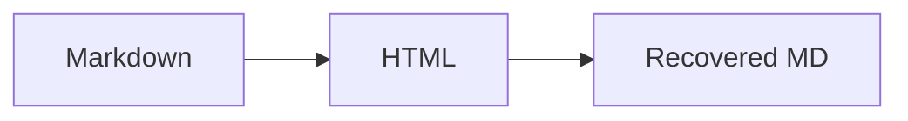

# Quikdown Bidirectional Editor

Welcome! Edit **either side** and watch them sync.  
## Try These Features

- Edit this *markdown* on the left
- Click and edit the rendered output on the right
- Check/uncheck task items below

## Task List

- [x] Try editing markdown
- [ ] Try editing rendered HTML
- [ ] Toggle dark theme

## Code blocks  
Fenced code works too
```javascript
// Code blocks work too!
console.log("Hello, Quikdown!");
```

> Edit this quote directly in the rdendered view!

## Mermaid Diagram



## More

- Edit this *markdown* on the left
- Click and edit the rendered output on the right
- Check/uncheck task items below
