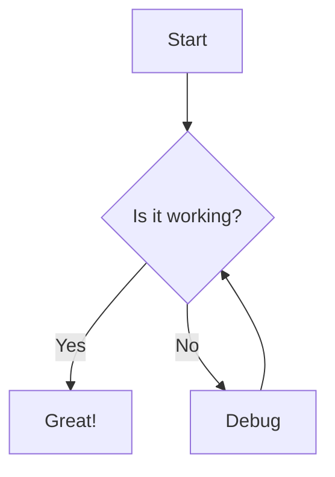

# Welcome to Quikdown Editor

This is a **full-featured** markdown editor with *live preview* and bidirectional editing support.

## Features

- ✨ **Three view modes**: Source, Split, and Preview
- 🔄 **Bidirectional editing**: Edit markdown or preview
- 🎨 **Theme support**: Light, dark, and auto themes
- 🔌 **Plugin integration**: Highlight.js and Mermaid

## Code Highlighting

```javascript
// Example with syntax highlighting
function greet(name) {
    console.log(`Hello, ${name}!`);
    return `Welcome to Quikdown Editor`;
}

greet('World');
```

## Mermaid Diagrams



## Tables

| Feature | Status | Notes |
|---------|--------|-------|
| Markdown Parsing | ✅ | Fast and secure |
| Bidirectional | ✅ | Edit either view |
| Plugins | ✅ | Extensible |

## Task Lists

- [x] Create markdown editor
- [x] Add live preview
- [x] Support bidirectional editing
- [ ] Add more features

## Links and Images

Check out the [Quikdown GitHub repo](https://github.com/deftio/quikdown) for more information.

---

> **Tip**: Try editing this content in either the markdown source or the preview panel!

### Keyboard Shortcuts

- `Ctrl/Cmd + 1` - Source mode
- `Ctrl/Cmd + 2` - Split mode  
- `Ctrl/Cmd + 3` - Preview mode