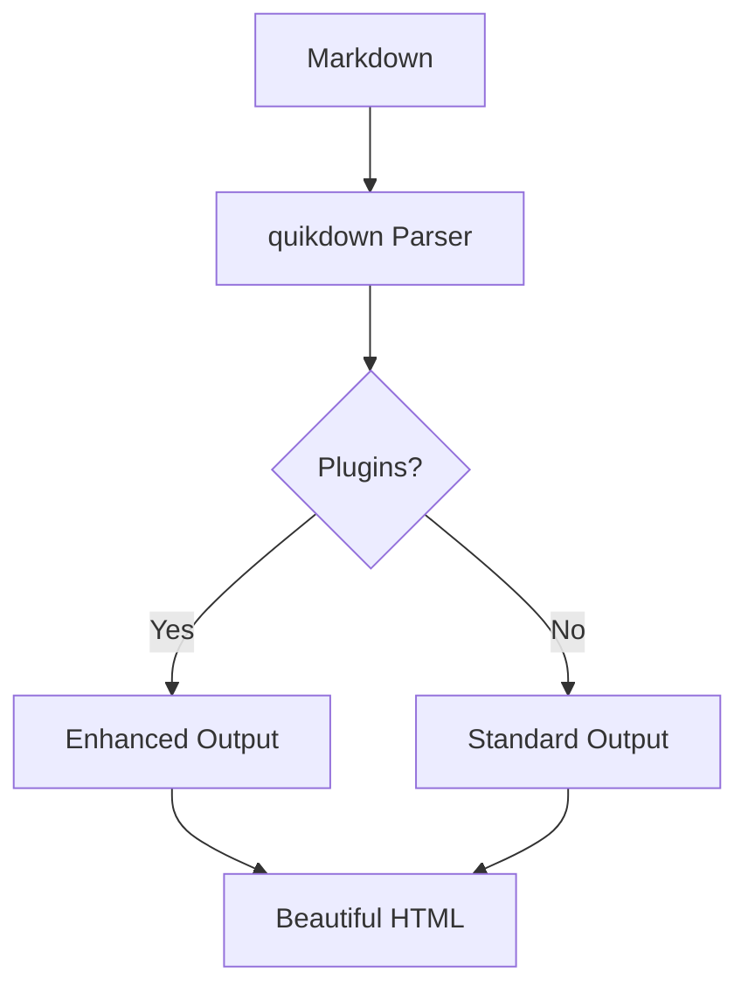

# Welcome to quikdown! 🚀

A **lightweight**, *fast* markdown parser with plugin support and built-in XSS protection.

## ✨ Key Features

- [x] **Zero dependencies** - No bloat
- [x] **Plugin system** - Extensible fence blocks
- [x] **XSS protection** - Secure by default
- [ ] Your feature request here!

## 📝 Markdown Support

### Text Formatting
You can use **bold**, *italic*, ~~strikethrough~~, and `inline code`.
Combine them for ***bold italic*** text!

### Links, Images and Autolinks

- Regular link: [GitHub Repository](https://github.com/deftio/quikdown)
- Autolink: https://npmjs.com/package/quikdown
- Badge: 
- Example Image:   
  

## 📊 Tables Without Trailing Pipes

Feature | Description | Status
:--------|:-------------:|-------:
Tables | Work without pipes | ✅
Alignment | Left, center, right | ✅
Markdown | **Bold** in cells | ✅


## 🎨 Code with Syntax Highlighting

```javascript
// quikdown with plugin support (v1.1.0+ API)
import quikdown from 'quikdown';

const html = quikdown(markdown, {
    fence_plugin: {
        render: (code, language) => {
            // Custom rendering for fence blocks
            if (language === 'mermaid') {
                return renderMermaid(code);
            }
            return hljs.highlight(code, {language}).value;
        }
    }
});
```

## 🔧 Alternative Fence Syntax

~~~python
# Python code with ~~~ fences
def parse_markdown(text):
    """Parse markdown with quikdown"""
    return quikdown(text)
~~~

## 📊 Mermaid Diagram Support
Quikdown can render mermaid via its built-in fence mechanism (which can provide call back for mermaidjs).



## 🛡️ Security Features

quikdown automatically escapes HTML to prevent XSS attacks:  
<script>alert('This will be escaped!')</script>

### Quote of the Day
> "The best markdown parser is one that gets out of your way."
> — Happy Developer

---

Try editing this content to see real-time conversion! 
*Render time is shown in the top-right corner.*