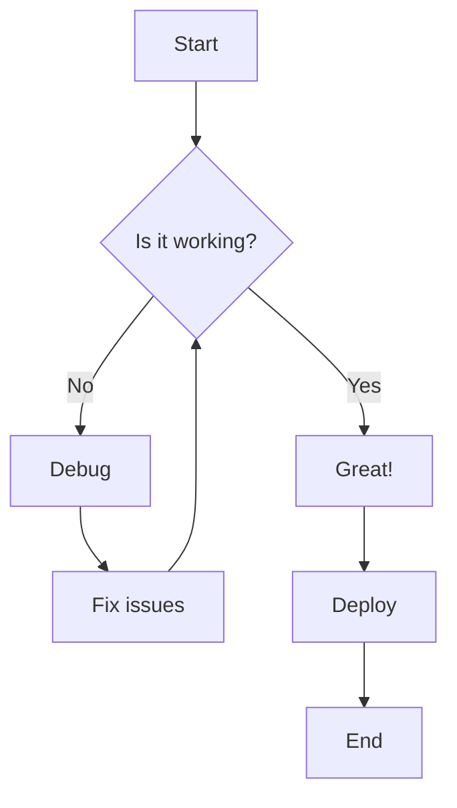
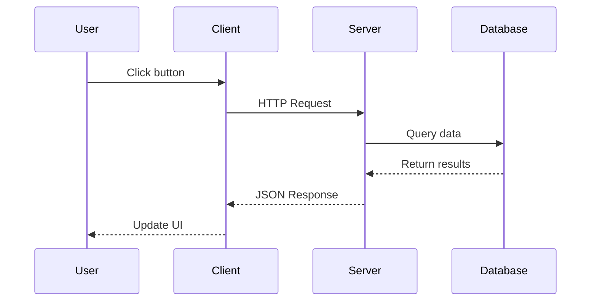
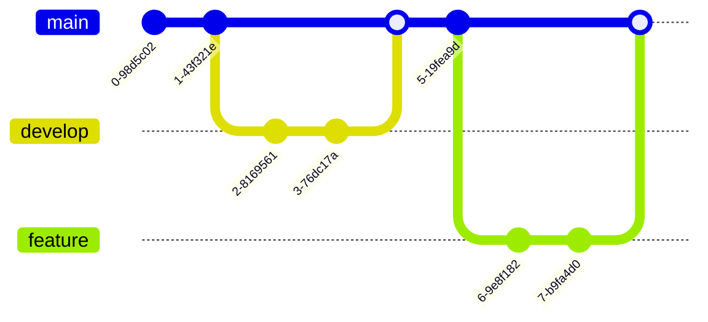

# Code Blocks and Fence Plugins

## Standard Code Blocks

### JavaScript with Syntax Highlighting

```javascript
// Function to calculate factorial
function factorial(n) {
    if (n <= 1) return 1;
    return n * factorial(n - 1);
}

console.log(factorial(5)); // Output: 120
```

### Python with ~~~ Fences

~~~python
# Fibonacci sequence generator
def fibonacci(n):
    a, b = 0, 1
    for _ in range(n):
        yield a
        a, b = b, a + b

# Generate first 10 numbers
for num in fibonacci(10):
    print(num, end=' ')
~~~

### HTML Example

```html
<!DOCTYPE html>
<html>
<head>
    <title>quikdown Demo</title>
</head>
<body>
    <h1>Hello World</h1>
</body>
</html>
```

## Mermaid Diagrams

### Flowchart



### Sequence Diagram



### Git Graph



## CSS Example

```css
/* quikdown styles */
.quikdown-pre {
    background: #f4f4f4;
    padding: 10px;
    border-radius: 4px;
    overflow-x: auto;
}

.quikdown-code {
    background: #f0f0f0;
    padding: 2px 4px;
    border-radius: 3px;
}
```