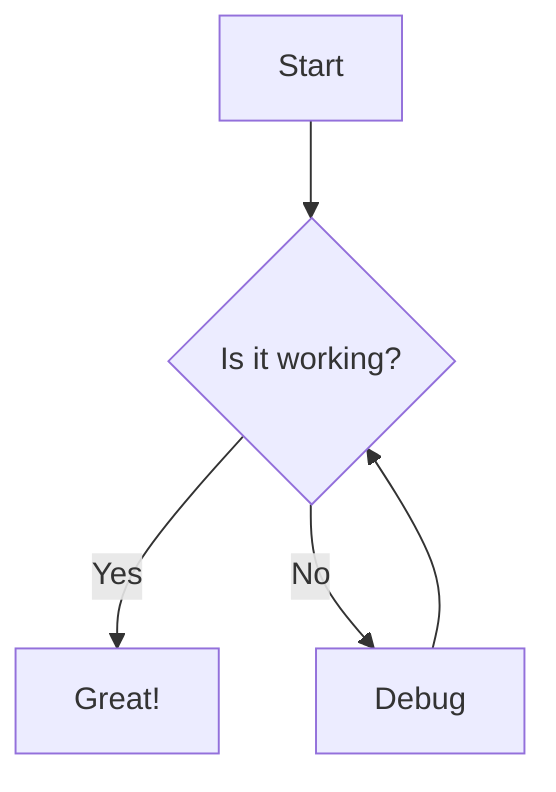

# Welcome to Quikdown Editor

This is a **full-featured** markdown editor with *live preview* and bidirectional editing support.## Features- ✨ **Three view modes**: Source, Split, and Preview
- 🔄 **Bidirectional editing**: Edit markdown or preview
- 🎨 **Theme support**: Light, dark, and auto themes
- 🔌 **Plugin integration**: Highlight.js and Mermaid

## Code Highlighting

```javascript
// Example with syntax highlighting
function greet(name) {
    console.log(`Hello, ${name}!`);
    return `Welcome to Quikdown Editor`;
}

greet('World');
```

## Mermaid Diagrams



## Code

```python
# python is fenced too
y=3
def nPlusOne(x):
    return x+11

print(nPlusOne(y))
```

## MD Table

| Feature | Description | Status |
| --- | --- | --- |
| Tables | Work with or without pipes | ✅ |
| Alignment | Left, center, right | ✅ |
| Markdown | Bold in cells | ✅ |

## CSV Table

```csv
a,b,c,d
1,2,3,4
3,4,5,6
```

## Math

```math
f(x)=sin(x)/x + \pi
```

## SVG

```svg

<svg xmlns="http://www.w3.org/2000/svg" viewBox="0 0 32 32">
  <!-- (c) deftio 2025 & M. A. Chatterjee-->
  <!-- Background -->
  <rect width="32" height="32" rx="4" fill="#9550bb"/>
  
  <!-- Scale q + arrow around the center -->
  <g transform="translate(16,16) scale(1.45) translate(-18.5,-17)">
    <!-- Letter 'q' -->
    <text x="9.25" y="19.5" font-family="Arial, sans-serif" font-size="18" font-weight="bold" fill="white">q</text>
    
    <!-- Down arrow -->
    <path d="M 22.5 10.25 L 22.5 20 L 19.5 20 L 24 25 L 28 20 L 25 20 L 25 10.25 Z" fill="white"/>
  </g>
</svg>
```

## Tables

| Feature | Status | Notes |
| --- | --- | --- |
| Markdown Parsing | ✅ | Fast and secure |
| Bidirectional | ✅ | Edit either view |
| Plugins | ✅ | Extensible |

## Task Lists

- [x] Create markdown editor
- [x] Add live preview
- [x] Support bidirectional editing
- [ ] Add more features

## Links and Images

Check out the [Quikdown GitHub repo](https://github.com/deftio/quikdown) for more information.---

> **Tip**: Try editing this content in either the markdown source or the preview panel!

### Keyboard Shortcuts

- `Ctrl/Cmd + 1` - Source mode
- `Ctrl/Cmd + 2` - Split mode
- `Ctrl/Cmd + 3` - Preview mode