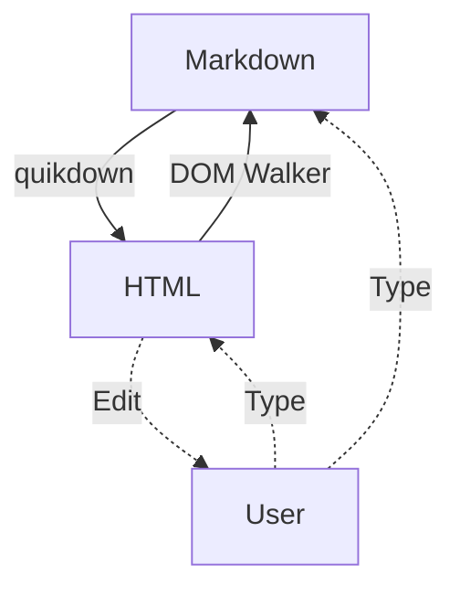

# Live Bidirectional Editor

Welcome to the **live bidirectional editor**! Edit either side and watch it sync.

## Features

- ✨ **Real-time sync** between Markdown and HTML
- 🎨 Edit the *rendered output* directly
- 🔄 Instant bidirectional conversion
- 🌙 Dark mode support

### Code Examples

Here's some inline `code` and a fenced block:

```javascript
// JavaScript example
function greet(name) {
    return `Hello, ${name}!`;
}

console.log(greet('World'));
```

### Python Example

```python
# Python example with syntax
def fibonacci(n):
    if n <= 1:
        return n
    return fibonacci(n-1) + fibonacci(n-2)

print([fibonacci(i) for i in range(10)])
```

### Bash Commands

```bash
# Install quikdown
npm install quikdown

# Use in Node.js
node -e "const qd = require('quikdown'); console.log(qd('# Hello'))"
```

## Tables

| Feature | Status | Notes |
|---------|--------|-------|
| Markdown → HTML | ✅ | Fast |
| HTML → Markdown | ✅ | DOM walking |
| Live sync | ✅ | Bidirectional |

## Lists

1. Edit markdown on the left
2. See it render on the right
3. Edit the rendered HTML directly
4. Watch markdown update automatically

### Task List

- [x] Create bidirectional converter
- [x] Add live sync
- [x] Support code blocks
- [ ] Add more features

> **Pro tip**: Try editing this blockquote directly in the rendered view!

## Mermaid Diagram Test



---

*Happy editing!* 🚀