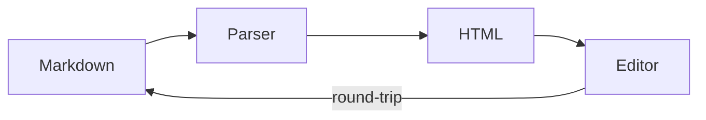

## Quikdown

A **lightweight** markdown parser and _editor_ for browsers and Node.js. Supports bidirectional editing, fence plugins, and themes.

### Diagram



### Math

```math
x = \frac{-b \pm \sqrt{b^2 - 4ac}}{2a}
```

### Code

```javascript
import QuikdownEditor from 'quikdown/edit';

const editor = new QuikdownEditor('#app', {
  mode: 'split',
  theme: 'auto',
  showUndoRedo: true
});
```

### Data

```csv
Module,Size,Deps,Bidirectional
quikdown.js,9.8 KB,0,No
quikdown_bd.js,14.6 KB,0,Yes
quikdown_edit.js,84.3 KB,lazy,Yes
quikdown_ast.js,4.9 KB,0,No
```
