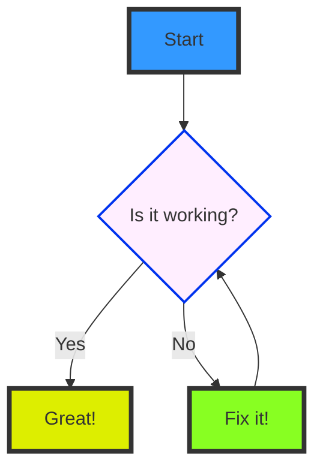

# Quikdown Graphical Markdown Editor

Welcome to the **Quikdown** live markdown editor. This document shows various features such as live preview, Mermaid diagrams, syntax-highlighted code blocks, tables, and inline SVG graphics.

[Code is on GitHub](https://github.com/deftio/quikdown)

Quikdown allows live view of source (markdown), rendered (HTML), or split-view for both. It can be used as a lightweight editor or as a headless component embedded in apps. Quikdown supports running headless (no toolbar) and can be styled or themed with CSS.

## Diagram Example

Below is a Mermaid diagram demonstrating a simple flow:



## Code Example

Here's a JavaScript code snippet with syntax highlighting:

```javascript
// A simple greeting function
let name = "World";
function greet(name) {
    console.log(`Hello, ${name}!`);
}

greet("World");

let config = {
    "name": "quikdown",
    "features": ["parser", "bidirectional", "editor"],
    "size": { "core": 9, "bd": 14, "editor": 72 }
};
```

## Basic Table Example

| Feature           | Supported |
| ----------------- | --------- |
| Live Preview      | Yes       |
| Mermaid Diagrams  | Yes       |
| Syntax Highlight  | Yes       |
| Table Styling     | Yes       |
| SVG Rendering     | Yes       |
| MathJax           | Yes       |
| GeoJSON Maps      | Yes       |
| STL 3D Models     | Yes       |
| Bidirectional     | Yes       |

## Inline SVG Example

```svg
<svg width="400" height="100" xmlns="http://www.w3.org/2000/svg">
    <circle cx="50" cy="50" r="40" stroke="green" stroke-width="4" fill="yellow" />
    <rect x="150" y="10" width="80" height="80" stroke="orange" stroke-width="4" fill="blue" />
    <text x="260" y="55" font-family="sans-serif" font-size="20" fill="purple">quikdown</text>
</svg>
```

## CSV / TSV / PSV Tables

Quikdown renders inline tables from CSV, TSV, or PSV separated entries.

### CSV Example

```csv
Name,Age,City
Alice,30,New York
Bob,24,Paris
Charlie,35,London
David,29,Berlin
Eve,42,Tokyo
```

### TSV Example

```tsv
Fruit	Color	Taste
Apple	Red	Sweet
Banana	Yellow	Sweet
Lemon	Yellow	Sour
Orange	Orange	Sweet
```

### PSV Example

```psv
ID|Product|Price|InStock
101|Laptop|1200|Yes
102|Mouse|25|Yes
103|Keyboard|75|No
104|Monitor|300|Yes
```

## Image Support

Markdown image syntax:


HTML image with width attribute (rendered via the `html` fence):

```html

```

## Math Block Example

```math
e^{i\pi} + 1 = 0
```

A more complex example:

```math
\begin{pmatrix}
a & b \\
c & d
\end{pmatrix} = \mathbf{X}
```

An integral:

```math
\int_{-\infty}^{\infty} e^{-x^2} dx = \sqrt{\pi}
```

A summation:

```math
\sum_{n=1}^{\infty} \frac{1}{n^2} = \frac{\pi^2}{6}
```

## GeoJSON Map

```geojson
{
  "type": "Feature",
  "geometry": {
    "type": "Point",
    "coordinates": [-74.0445, 40.6892]
  },
  "properties": {
    "name": "Statue of Liberty"
  }
}
```

## STL 3D Model

```stl
solid cube
  facet normal 0 0 1
    outer loop
      vertex 0 0 1
      vertex 1 0 1
      vertex 1 1 1
    endloop
  endfacet
  facet normal 0 0 1
    outer loop
      vertex 0 0 1
      vertex 1 1 1
      vertex 0 1 1
    endloop
  endfacet
  facet normal 0 0 -1
    outer loop
      vertex 0 0 0
      vertex 1 1 0
      vertex 1 0 0
    endloop
  endfacet
  facet normal 0 0 -1
    outer loop
      vertex 0 0 0
      vertex 0 1 0
      vertex 1 1 0
    endloop
  endfacet
  facet normal 0 1 0
    outer loop
      vertex 0 1 0
      vertex 0 1 1
      vertex 1 1 1
    endloop
  endfacet
  facet normal 0 1 0
    outer loop
      vertex 0 1 0
      vertex 1 1 1
      vertex 1 1 0
    endloop
  endfacet
  facet normal 0 -1 0
    outer loop
      vertex 0 0 0
      vertex 1 0 1
      vertex 0 0 1
    endloop
  endfacet
  facet normal 0 -1 0
    outer loop
      vertex 0 0 0
      vertex 1 0 0
      vertex 1 0 1
    endloop
  endfacet
  facet normal 1 0 0
    outer loop
      vertex 1 0 0
      vertex 1 1 0
      vertex 1 1 1
    endloop
  endfacet
  facet normal 1 0 0
    outer loop
      vertex 1 0 0
      vertex 1 1 1
      vertex 1 0 1
    endloop
  endfacet
  facet normal -1 0 0
    outer loop
      vertex 0 0 0
      vertex 0 1 1
      vertex 0 1 0
    endloop
  endfacet
  facet normal -1 0 0
    outer loop
      vertex 0 0 0
      vertex 0 0 1
      vertex 0 1 1
    endloop
  endfacet
endsolid cube
```

## Additional Content

You can include regular markdown features:

- **Bold** and *italic* text work seamlessly
- ~~Strikethrough~~ and `inline code`
- Task lists:
  - [x] Bidirectional editing
  - [x] Fence plugins
  - [x] Light, dark, auto themes
  - [ ] Your next markdown app
- [Links](https://github.com/deftio/quikdown) to external sites

> A blockquote with **formatting**
> spanning multiple lines.

---

Built with [quikdown](https://github.com/deftio/quikdown).
